# GYMFITNESS DATABASE DESIGN

## 1. Phạm vi

Database dùng MySQL 8.0+ và phục vụ ba vai trò `ADMIN`, `USER`, `PT`. Thiết kế bao phủ đăng nhập, hồ sơ, gói Gym/Yoga, thanh toán QR, lịch tập, check-in QR, lịch PT, lượt PT trả phí, lớp học, cửa hàng, thiết bị, thông báo và audit log.

DDL bảng nằm tại [`database/01_tables.sql`](../database/01_tables.sql) và trigger kiểm tra lịch nằm tại [`database/02_triggers.sql`](../database/02_triggers.sql).

## 2. Sơ đồ quan hệ tổng quan

```mermaid
erDiagram
    USERS ||--|| USER_PROFILES : has
    USERS ||--o{ USER_ADDRESSES : saves
    USERS ||--o| MEMBERS : owns
    USERS ||--o| TRAINER_PROFILES : owns
    USERS ||--o{ REFRESH_TOKENS : authenticates
    USERS ||--o{ NOTIFICATIONS : receives

    MEMBERS ||--o{ MEMBERSHIP_SUBSCRIPTIONS : subscribes
    MEMBERSHIP_PLANS ||--o{ MEMBERSHIP_SUBSCRIPTIONS : defines
    PAYMENTS ||--o| MEMBERSHIP_SUBSCRIPTIONS : activates
    MEMBERSHIP_SUBSCRIPTIONS ||--o{ WORKOUT_SCHEDULE_ENTRIES : generates
    MEMBERSHIP_SUBSCRIPTIONS ||--o{ CHECK_INS : authorizes
    QR_NONCES ||--o| CHECK_INS : validates

    MEMBERS ||--|| PT_CREDIT_ACCOUNTS : owns
    PT_CREDIT_ACCOUNTS ||--o{ PT_CREDIT_PURCHASES : receives
    PAYMENTS ||--o| PT_CREDIT_PURCHASES : credits
    PT_CREDIT_ACCOUNTS ||--o{ PT_CREDIT_LEDGER : records
    TRAINER_PROFILES ||--o{ TRAINER_AVAILABILITY : publishes
    TRAINER_PROFILES ||--o{ PT_BOOKINGS : accepts
    MEMBERS ||--o{ PT_BOOKINGS : requests
    PT_BOOKINGS ||--o{ PT_CREDIT_LEDGER : consumes

    CLASS_TYPES ||--o{ CLASS_SESSIONS : schedules
    TRAINER_PROFILES ||--o{ CLASS_SESSIONS : leads
    ROOMS ||--o{ CLASS_SESSIONS : hosts
    CLASS_SESSIONS ||--o{ CLASS_BOOKINGS : receives
    MEMBERS ||--o{ CLASS_BOOKINGS : makes

    PRODUCT_CATEGORIES ||--o{ PRODUCTS : groups
    PRODUCTS ||--o{ PRODUCT_VARIANTS : offers
    PRODUCT_VARIANTS ||--o{ CART_ITEMS : selected
    USERS ||--|| CARTS : owns
    CARTS ||--o{ CART_ITEMS : contains
    USERS ||--o{ ORDERS : places
    ORDERS ||--|| ORDER_ADDRESSES : snapshots
    ORDERS ||--o{ ORDER_ITEMS : contains
    PAYMENTS ||--o| ORDERS : pays

    PAYMENTS ||--o| INVOICES : produces
    EQUIPMENT ||--o{ MAINTENANCE_RECORDS : receives
    USERS ||--o{ AUDIT_LOGS : acts
```



## 3. Nhóm bảng

### Tài khoản và hồ sơ

| Bảng | Vai trò |
| --- | --- |
| `users` | Thông tin đăng nhập, role và trạng thái tài khoản |
| `user_profiles` | Thông tin cá nhân, ảnh đại diện, chỉ số cơ thể và mục tiêu |
| `user_addresses` | Nhiều địa chỉ nhận hàng, tối đa một địa chỉ mặc định |
| `members` | Hồ sơ hội viên nghiệp vụ, có thể do Admin tạo trước tài khoản |
| `trainer_profiles` | Hồ sơ PT, giá buổi tập và trạng thái làm việc |
| `trainer_specialties` | Chuyên môn Gym/Yoga và mục tiêu PT hỗ trợ |
| `refresh_tokens` | Refresh token đã băm và có khả năng revoke |
| `password_reset_tokens` | Token đặt lại mật khẩu dùng một lần |
| `file_assets` | Metadata ảnh đại diện, ảnh sản phẩm và PDF riêng tư |

### Hội viên và lịch tập

| Bảng | Vai trò |
| --- | --- |
| `membership_plans` | Gói Gym/Yoga theo tháng, năm hoặc số ngày |
| `membership_subscriptions` | Gói user đã mua cùng ngày bắt đầu/kết thúc |
| `subscription_status_history` | Lịch sử chuyển trạng thái gói |
| `subscription_freeze_history` | Lịch sử đóng băng và số ngày được cấp |
| `workout_schedule_entries` | Ngày tập Gym/Yoga, nghỉ, lớp hoặc buổi PT |
| `qr_nonces` | Nonce QR check-in ngắn hạn và chống dùng lại |
| `check_ins` | Check-in/check-out tại chi nhánh |

### PT

| Bảng | Vai trò |
| --- | --- |
| `pt_credit_accounts` | Tổng lượt đã mua, đang giữ và đã dùng |
| `pt_credit_purchases` | Giao dịch mua gói lượt PT |
| `pt_credit_ledger` | Sổ cái bất biến cho mọi biến động lượt PT |
| `trainer_availability` | Các khoảng rảnh/bận PT tự thiết lập |
| `pt_bookings` | Yêu cầu, phản hồi và kết quả buổi PT |

### Thanh toán và bán hàng

| Bảng | Vai trò |
| --- | --- |
| `payments` | Thanh toán hội viên, lượt PT hoặc đơn sản phẩm |
| `payment_events` | Webhook có idempotency và lưu payload để đối soát |
| `invoices` | Hóa đơn và tệp PDF |
| `products`, `product_variants` | Danh mục sản phẩm, SKU, giá và tồn kho |
| `carts`, `cart_items` | Giỏ hàng đang hoạt động |
| `orders`, `order_items` | Đơn hàng và snapshot sản phẩm tại lúc mua |
| `order_addresses` | Snapshot địa chỉ giao hàng không phụ thuộc profile |
| `inventory_movements` | Sổ cái nhập, giữ, bán, trả và điều chỉnh tồn kho |

### Vận hành

| Bảng | Vai trò |
| --- | --- |
| `branches`, `rooms` | Chi nhánh và phòng tập |
| `class_types`, `class_sessions`, `class_bookings` | Lớp Gym/Yoga, sức chứa và waitlist |
| `equipment`, `maintenance_records` | Thiết bị và lịch sử bảo trì |
| `notifications` | Thông báo trong app và trạng thái gửi email |
| `background_jobs` | Trạng thái Celery job, export và tạo PDF |
| `audit_logs` | Truy vết hành động nhạy cảm |

## 4. Quy tắc dữ liệu quan trọng

### Kích hoạt hội viên

1. Tạo `payments` với `purpose = MEMBERSHIP`, `status = PENDING`.
2. Tạo `membership_subscriptions` ở trạng thái `PENDING`.
3. Webhook hợp lệ cập nhật payment thành `PAID`.
4. Trong cùng transaction, cập nhật subscription thành `ACTIVE`, đặt `start_at`, `end_at` và ghi `subscription_status_history`.
5. Sinh các `workout_schedule_entries` theo Gym/Yoga và hồ sơ user.

Không kích hoạt gói chỉ dựa trên kết quả trả về ở frontend.

### Ngày bắt đầu và kết thúc

- Gói tháng/năm dùng `duration_months` để giữ đúng lịch tháng.
- Gói ngày dùng `duration_days`.
- Chỉ một trong hai trường thời hạn được phép có giá trị.
- `end_at` luôn lớn hơn `start_at`.

### Lượt PT

Giá trị khả dụng:

```text
available = purchased_sessions - reserved_sessions - used_sessions
```

Các thao tác phải khóa hàng `pt_credit_accounts` bằng `SELECT ... FOR UPDATE`:

| Sự kiện | purchased | reserved | used |
| --- | ---: | ---: | ---: |
| Thanh toán 5 buổi | +5 | 0 | 0 |
| Gửi yêu cầu PT | 0 | +1 | 0 |
| PT từ chối/hết hạn | 0 | -1 | 0 |
| Hoàn thành buổi | 0 | -1 | +1 |
| Điều chỉnh Admin | Theo giao dịch | Theo giao dịch | Theo giao dịch |

Mỗi thay đổi đồng thời cập nhật account và chèn một dòng `pt_credit_ledger` có `idempotency_key`. Constraint ngăn tổng `reserved + used` vượt `purchased`.

### Booking PT

- Một booking tương ứng một buổi và một lượt PT.
- Trạng thái `REJECTED` bắt buộc có `rejection_reason`.
- Trigger MySQL chặn PT hoặc member có hai booking `REQUESTED/ACCEPTED` chồng giờ; service vẫn khóa dữ liệu trong transaction để xử lý request đồng thời.
- Yêu cầu hết `response_due_at` được worker chuyển thành `EXPIRED` và hoàn lượt đang giữ.
- Chỉ lịch `AVAILABLE`, subscription còn hiệu lực và đúng `activity_type` mới được đặt.

### Check-in QR

- Chỉ lưu hash nonce, không lưu token check-in nguyên bản.
- `nonce_hash` là duy nhất và mỗi nonce chỉ gắn tối đa một check-in.
- Partial unique index ngăn một member có hai lượt check-in chưa checkout.
- Redis có thể chặn replay nhanh; database vẫn là lớp bảo vệ cuối cùng.

### Địa chỉ và đơn hàng

- `user_addresses` cho phép nhiều địa chỉ nhưng chỉ một địa chỉ mặc định.
- `order_addresses` lưu snapshot riêng tại thời điểm đặt hàng.
- `order_items` lưu SKU, tên, thuộc tính và giá snapshot.
- Sửa profile, địa chỉ hoặc sản phẩm không làm thay đổi đơn cũ.

### Tiền và thanh toán

- Tiền dùng `NUMERIC(14,2)`, currency mặc định `VND`.
- Mỗi payment có `idempotency_key`.
- Webhook được chống lặp bằng `(provider, provider_event_id)`.
- Tổng hóa đơn là generated column: `subtotal + tax - discount`.
- Payment `PAID` bắt buộc có `paid_at`.

## 5. Index và tính đồng thời

Schema có index cho các truy vấn chính:

- Tìm user theo email/phone/role/status.
- Tìm subscription active và sắp hết hạn.
- Lịch user/PT theo thời gian.
- Booking PT đang chờ phản hồi.
- Check-in theo member, chi nhánh và ngày.
- Notification chưa đọc.
- Order/payment theo user và trạng thái.
- Sản phẩm theo danh mục và SKU.
- Audit theo actor hoặc entity.

Các luồng payment, kích hoạt subscription, giữ lượt PT, booking, waitlist và tồn kho phải chạy trong transaction. API cập nhật record nhạy cảm phải dùng `row_version` để phát hiện ghi đè đồng thời và trả HTTP `409 Conflict`.

## 6. Quy tắc xóa

- `users`, `members`, `membership_plans`, `subscriptions`, `products`, `equipment` và booking dùng soft-delete khi phù hợp.
- Payment, invoice, check-in, ledger, inventory movement và audit log không xóa vật lý.
- Foreign key lịch sử ưu tiên `RESTRICT` hoặc `SET NULL`; không cascade làm mất dữ liệu tài chính/nghiệp vụ.

## 7. Thứ tự migration đề xuất

1. Extensions và hàm dùng chung.
2. Branch, user, token, file và profile.
3. Member và trainer.
4. Payment, plan và subscription.
5. Lịch tập, QR và check-in.
6. PT credit, availability và booking.
7. Class, room và class booking.
8. Product, inventory, cart và order.
9. Invoice, equipment, notification, job và audit.
10. Index, trigger chống trùng lịch và quy tắc transaction.

Khi triển khai backend, `schema.sql` được chuyển thành các migration Alembic nhỏ theo thứ tự trên; không chạy một migration duy nhất trong production.
